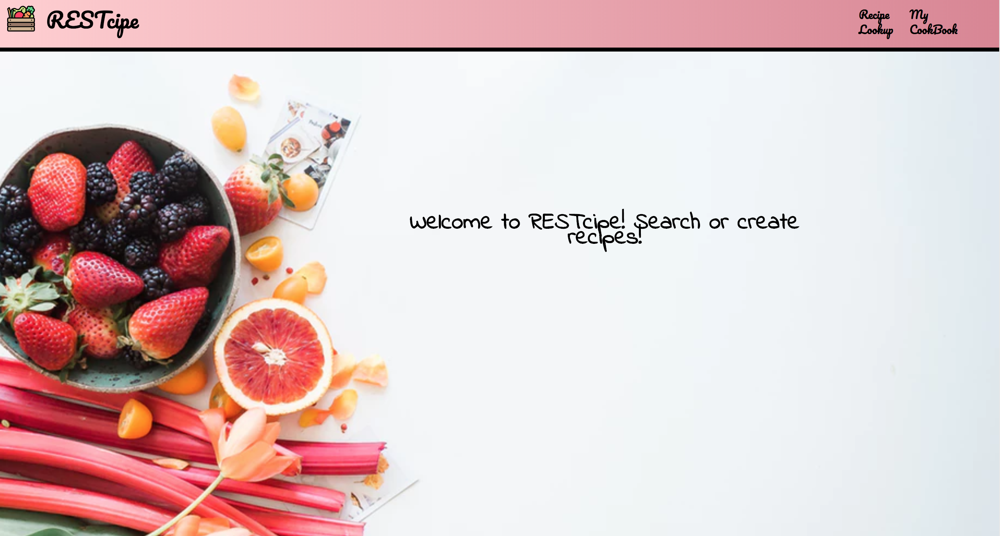

## RESTcipe
An application for creating and finding recipes

## Motivation
To create an application to find recipes based on ingredient(currently works only if  a recipe contains an ingredients name)

## Demo
A Demo of this project can be found at :

[Youtube](https://www.youtube.com/watch?v=x62FL7pYk9g)

## Built with

* React
* Ruby on Rails
* Yummly API

## Installation
Run NPM install
Run NPM start

## How to use

You can use the Recipe LookUp NavLink to search for recipes based on search parameters

You can use the My CookBook NavLink to create your own recipe and save it to the back end server.

This project works in correlation with [RESTcipe Backend](https://github.com/mik3wk/RESTcipe-backend)
